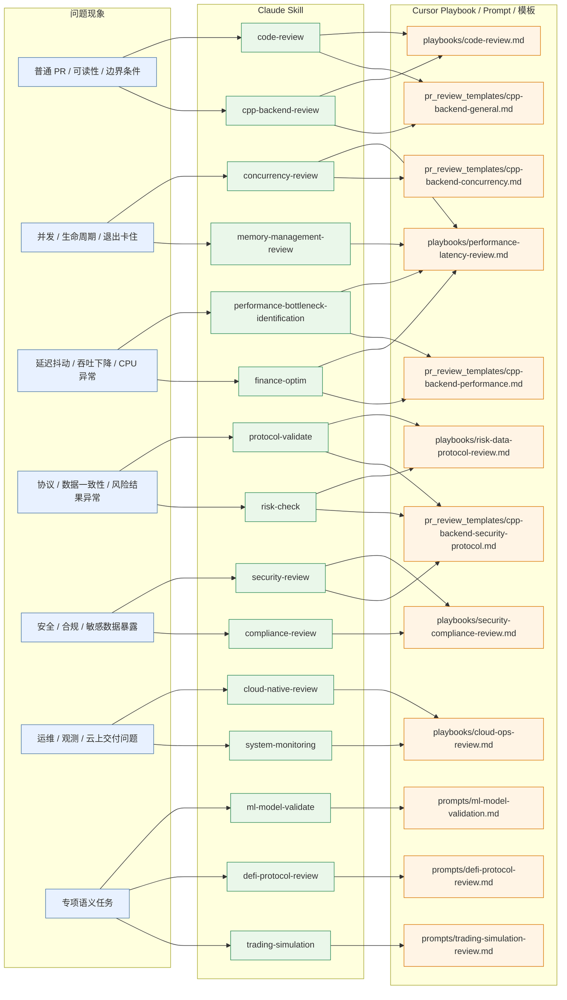

# 按问题现象选 Claude Skill / Cursor Playbook / Prompt

## 单页导航图

## 最短使用法

- 先按“问题现象”选一组 `Claude Skill`。
- 再落到对应的 `Cursor Playbook`。
- 如果是 C++ 服务端 PR，再补对应 `pr_review_templates/`。
- 只有遇到强领域语义任务时，才进入 `prompts/`。

## 一句话规则

- 普通代码问题：先 `code-review`
- 并发与性能：优先 `performance-latency-review.md`
- 协议与风险：优先 `risk-data-protocol-review.md`
- 安全与合规：优先 `security-compliance-review.md`
- 云上交付与观测：优先 `cloud-ops-review.md`
